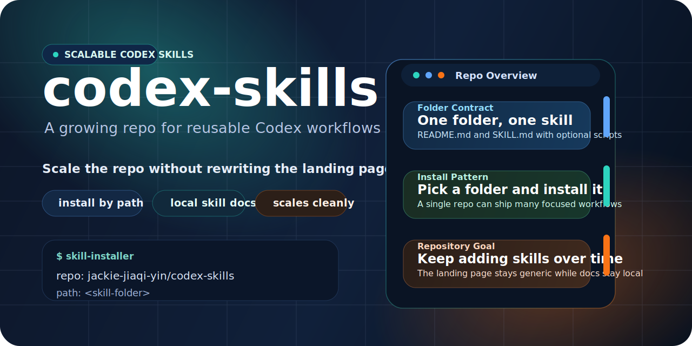

# codex-skills



Custom Codex skills by [jackie-jiaqi-yin](https://github.com/jackie-jiaqi-yin).

## What This Repo Is

This repository stores installable Codex skill folders.

Each top-level skill folder is expected to contain:

- `SKILL.md` as the actual Codex skill definition
- `README.md` as the GitHub-facing usage guide
- optional `agents/`, `scripts/`, `assets/`, and `references/` for implementation details

The homepage stays generic on purpose so the repo can keep growing without rewriting this file every time a new skill is added.

## Catalog

Current skill folders in this repository:

| Folder | Summary | Open |
|---|---|---|
| `arxiv-latest-summary` | Generate readable summaries of recent arXiv papers and export polished reports. | [README](./arxiv-latest-summary/README.md) |
| `experiment-results-notebook` | Centralize messy experiment outputs into a structured research notebook with Markdown, LaTeX, and PDF exports. | [README](./experiment-results-notebook/README.md) |

## Discover Available Skills

List the top-level skill folders in this repository:

```bash
find . -mindepth 1 -maxdepth 1 -type d ! -name .git ! -name assets | sort
```

Then open the usage guide for the folder you want:

```bash
open ./<skill-folder>/README.md
```

Or browse directly on GitHub:

```text
<repo>/<skill-folder>/README.md
```

## Quick Start

In a Codex chat, ask Codex to install one skill from this repo by folder path:

```text
Use $skill-installer to install a skill from GitHub:
- repo: jackie-jiaqi-yin/codex-skills
- path: <skill-folder>
After install, remind me to restart Codex.
```

If you want to install more than one, repeat the `path:` line with additional folder names.

## Install From Terminal

Install one skill:

```bash
CODEX_HOME="${CODEX_HOME:-$HOME/.codex}"
python "$CODEX_HOME/skills/.system/skill-installer/scripts/install-skill-from-github.py" \
  --repo jackie-jiaqi-yin/codex-skills \
  --path <skill-folder>
```

Install several skills at once:

```bash
CODEX_HOME="${CODEX_HOME:-$HOME/.codex}"
python "$CODEX_HOME/skills/.system/skill-installer/scripts/install-skill-from-github.py" \
  --repo jackie-jiaqi-yin/codex-skills \
  --path <skill-folder-a> \
  --path <skill-folder-b>
```

Restart Codex after install so newly added skills are loaded.

## Install Manually

```bash
git clone https://github.com/jackie-jiaqi-yin/codex-skills.git
cd codex-skills

CODEX_HOME="${CODEX_HOME:-$HOME/.codex}"
mkdir -p "$CODEX_HOME/skills"
cp -R <skill-folder> "$CODEX_HOME/skills/"
```

Repeat the `cp -R` command for any additional skill folders you want to install.

## Verify Installation

```bash
CODEX_HOME="${CODEX_HOME:-$HOME/.codex}"
ls "$CODEX_HOME/skills"
```

You should see the skill folders you installed.

## Update Or Reinstall One Skill

```bash
CODEX_HOME="${CODEX_HOME:-$HOME/.codex}"
rm -rf "$CODEX_HOME/skills/<skill-folder>"
python "$CODEX_HOME/skills/.system/skill-installer/scripts/install-skill-from-github.py" \
  --repo jackie-jiaqi-yin/codex-skills \
  --path <skill-folder>
```

## Uninstall

```bash
CODEX_HOME="${CODEX_HOME:-$HOME/.codex}"
rm -rf "$CODEX_HOME/skills/<skill-folder>"
```

## Repository Conventions

- Every installable skill should live in its own top-level folder.
- Every skill folder should keep its own `README.md` up to date so usage stays local to the skill.
- The repository homepage should explain discovery and installation, not duplicate every skill's full documentation.
- Skill-specific dependencies should be documented inside that skill's own README.
